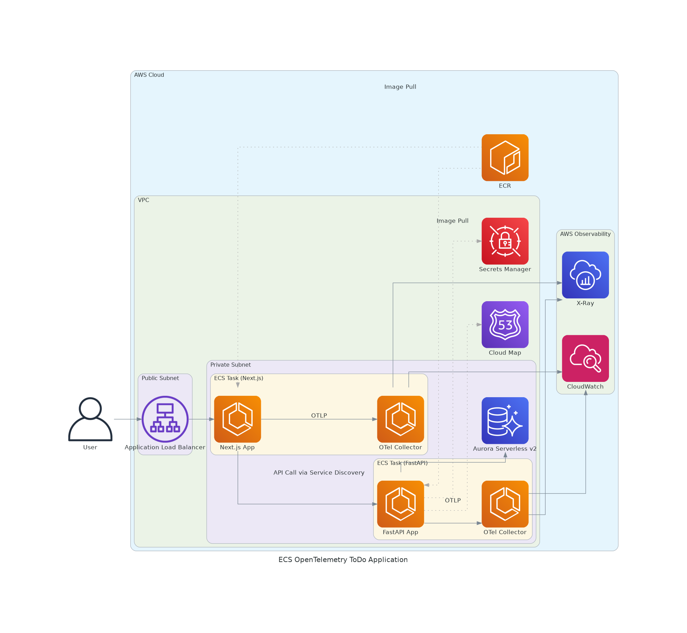

# 設計書: ECS OpenTelemetry ToDoアプリケーション

## 1. 概要

本ドキュメントは、ECS上で動作するToDoアプリケーションからOpenTelemetry(OTel)を用いてテレメトリデータを収集し、AWS CloudWatchおよびAWS X-Rayで可視化する検証環境の設計について記述する。

### 1.1. 検証目的

- ECS on Fargateで動作する多層アプリケーション(Next.js, FastAPI)にOTel SDKを導入する。
- OTel Collectorをサイドカーとしてデプロイし、アプリケーションからOTLP形式でテレメトリデータ（メトリクス、トレース）を受信する。
- OTel Collectorが受信したデータをCloudWatch (EMF形式のメトリクス) および X-Ray (トレース) に送信する。
- FastAPIアプリケーションからAurora Serverlessデータベースへの接続と、サービス間通信を確立する。
- 上記の構成が実現可能で��ること（フィージビリティ）を確認する。

### 1.2. 全体アーキテクチャ図



この図は`docs/architecture.py`によって生成されます。図を更新する場合は、スクリプトを実行してください。

```bash
python docs/architecture.py
```

## 2. アプリケーション仕様

### 2.1. 機能要件

- ToDoアイテムの作成、読み取り、更新（完了/未完了）、削除 (CRUD) ができるシンプルなWebアプリケーション。

### 2.2. フロントエンド (Next.js)

- **フレームワーク**: Next.js (App Router)
- **UI**: React Server ComponentsとServer Actionsを利用して、ToDoリストの表示と操作を行う。
- **API通信**: ブラウザからの直接的なバックエンド呼び出しを避けるため、Next.jsのAPI Routesをプロキシとして使用する。クライアントからのリクエストはNext.jsサーバーを経由してFastAPIに転送される。
- **主なライブラリ**: React, Tailwind CSS

### 2.3. バックエンド (FastAPI)

- **フレームワーク**: FastAPI
- **データベース**: PostgreSQL (Aurora Serverless v2)
- **APIエンドポイント**:
    - `GET /api/todos/`: 全てのToDoを取得
    - `POST /api/todos/`: 新しいToDoを作成
    - `PUT /api/todos/{id}`: ToDoを更新
    - `DELETE /api/todos/{id}`: ToDoを削除
- **主なライブラリ**: Uvicorn, SQLAlchemy, Psycopg2, Boto3

## 3. インフラストラクチャ構成 (Terraform)

Terraformを使用して以下のAWSリソースをプロビジョニングする。

### 3.1. ネットワーク (modules: `terraform-aws-modules/vpc/aws`)

- **VPC**: `10.0.0.0/16` のCIDRを持つVPCを1つ作成する。
- **サブネット**:
    - パブリックサブネット x3 (ALB配置用)
    - プライベートサブネット x3 (ECSタスク、Aurora DB配置用)
- **NATゲートウェイ**: プライベートサブネットからのアウトバウンド通信用に単一のNATゲートウェイを配置する。

### 3.2. データベース

- **Aurora Serverless v2 (PostgreSQL)**:
    - プライベートサブネットに配置されるServerless v2クラスター。
    - `0.5` ACUから `2` ACUの範囲で自動的にスケー���ングする。
- **DBサブネットグループ**: Auroraクラスターが使用するプライベートサブネットを定義する。
- **セキュリティグループ**: FastAPIサービスのセキュリティグループからのみポート `5432` へのインバウンドトラフィックを許可する。
- **Secrets Manager**: 
    - データベースのマスターユーザー名とパスワードを安全に保管する。
    - FastAPIタスクのIAMロールにこのシークレットへの読み取りアクセス権を付与する。

### 3.3. コンテナ (modules: `terraform-aws-modules/ecs/aws`, `terraform-aws-modules/alb/aws`)

- **ECR**: 
    - `nextjs-app` と `fastapi-app` の2つのECRリポジトリを作成する。
- **ECSクラスター**: `ecs-opentelemetry-cluster` という名前のECSクラスターを1つ作成する。
- **ALB (Application Load Balancer)**:
    - インターネットからのHTTPリクエスト(ポート80)を受け付けるALBをパブリックサブネットに配置する。
- **ECSタスク定義 & サービス**:
    - **Next.jsサービス**: Fargateで実行。ALBからのトラフィッ���を受け付ける。
    - **FastAPIサービス**: Fargateで実行。VPC内からのトラフィックのみ受け付ける。
    - **サービスディスカバリ**: Cloud Mapに `fastapi.local` という名前で登録し、Next.jsサービスから名前解決でアクセスできるようにする。

### 3.4. オブザーバビリティ

- **IAMロール**:
    - **ECS実行ロール**: タスクがECRイメージのプル、CloudWatchへのログ書き込み、SSMからの設定読み取りを行う。
    - **ECSタスクロール**: アプリケーションがCloudWatch、X-Ray、Secrets Managerにアクセスする。
- **OpenTelemetry Collector (ADOT) サイドカー**:
    - 各タスク（Next.js, FastAPI）にサイドカーとしてデプロイ。
    - OTLPでデータを受信し、`awsxray` と `awsemf` エクスポーター経由でAWSサービスにデータを送信する。

## 4. アプリケーション・インフラ連携

- **環境変数**: ECSタスク定義を通じて、DBホスト名やSecrets ManagerのARNなどの構成情報をコンテナに渡す。
- **コンテナイメージ**: アプリケーションはDockerfileでコンテナ化され、ECRにプッシュされる。ECSサービスはECRから該当イメージをプルして実行する。
- **OpenTelemetry**: アプリケーションはOTel SDKで計装され、環境変数 `OTEL_EXPORTER_OTLP_ENDPOINT` を通じて同タスク内のADOT Collectorにデータを送信する。
